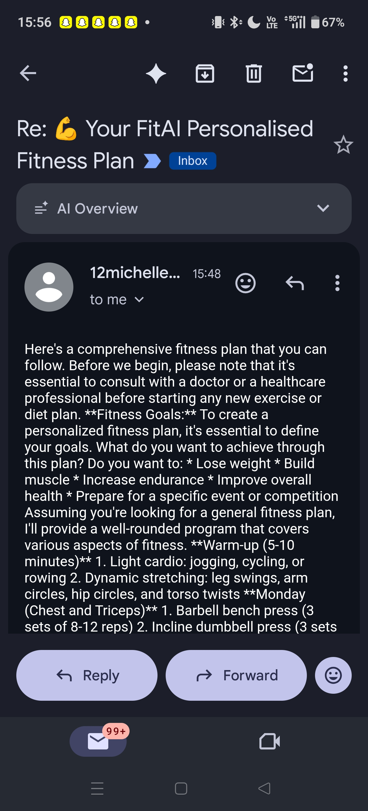

# FitAI – AI-Powered Fitness Ecosystem

An AI-powered full-stack fitness web app that generates personalised weekly workout and nutrition plans, supports an AI chat coach, finds nearby gyms, lists fitness events, and emails the generated plan directly to you — with full **n8n workflow automation** support for advanced integrations.

**Live Demo**
- Frontend: https://fitness-six-psi.vercel.app
- Backend API: https://fitness-us06.onrender.com

---

## Features

- **AI Plan Generator** — Personalised 7-day workout + nutrition plan via Groq (LLaMA 3.3 70B)
- **Email Delivery** — Full plan emailed automatically on generation via Gmail SMTP
- **n8n Workflow Automation** — Trigger multi-step automations every time a plan is generated (Slack alerts, Google Sheets logging, CRM updates, weekly reminders, and more)
- **AI Chat Coach** — Real-time fitness Q&A powered by the same LLM
- **Nearby Gyms** — Location-based gym finder using TomTom Maps API
- **Fitness Events** — Browse local fitness events and workshops
- **Workout Videos** — Curated exercise video library

---

## Tech Stack

| Layer | Technology |
|-------|-----------|
| Frontend | React 19, Tailwind CSS, Framer Motion |
| Backend | FastAPI, Python 3.12, Uvicorn |
| AI / LLM | Groq Cloud — `llama-3.3-70b-versatile` |
| Email | Python `smtplib` + Gmail SMTP |
| Automation | n8n (self-hosted or cloud) |
| Maps | TomTom Maps API |
| Deployment | Vercel (frontend), Render (backend) |

---

## n8n Integration

FitAI is built with **n8n automation** in mind. Every time a fitness plan is generated, the FastAPI backend can fire a webhook that triggers an n8n workflow — enabling powerful no-code / low-code automations without changing any backend code.

### 📧 Email Preview

Here's what the auto-generated plan email looks like when received:



### What you can automate with n8n

| Workflow | Description |
|----------|-------------|
| 📧 **Email / Notification** | Send the plan as a rich HTML email via Gmail, Outlook, or SendGrid node |
| 📊 **Google Sheets Logging** | Append every generated plan (user profile + timestamp) to a spreadsheet for analytics |
| 💬 **Slack / Discord Alert** | Post a summary to a Slack channel or Discord server every time a new plan is created |
| 🔁 **Weekly Reminder Emails** | Schedule weekly follow-up emails to the user reminding them of their plan |
| 🗓️ **Google Calendar Events** | Auto-create calendar events for each workout day from the plan |
| 📱 **WhatsApp / Telegram** | Send the plan summary via Twilio WhatsApp or Telegram Bot node |
| 🗃️ **CRM / Airtable / Notion** | Log new users and their goals into a CRM, Airtable base, or Notion database |
| 🔔 **Multi-channel Broadcast** | Combine email + Slack + Sheets in a single automated workflow triggered by one webhook |

### How the webhook integration works

1. **FitAI backend** calls `POST https://your-n8n-instance.com/webhook/fitai-plan` after generating a plan, passing the full plan JSON as the body.
2. **n8n Webhook node** receives the payload and starts the workflow.
3. Subsequent n8n nodes process, transform, and route the data to any service.

#### FastAPI webhook call (already structured for easy addition)

```python
# In backend/app/services/ai_service.py or a dedicated webhook_service.py
import httpx

async def trigger_n8n_webhook(plan: dict, user_data: dict):
    webhook_url = os.getenv("N8N_WEBHOOK_URL")
    if not webhook_url:
        return
    async with httpx.AsyncClient() as client:
        await client.post(webhook_url, json={"plan": plan, "user": user_data}, timeout=10)
```

#### Example n8n workflow: Plan → Gmail + Google Sheets

```
[Webhook] → [Set fields] → [Gmail: Send email]
                        ↘ [Google Sheets: Append row]
```

#### n8n Webhook node setup

1. Open n8n → New Workflow → Add **Webhook** node
2. Set HTTP Method: `POST`, Path: `fitai-plan`
3. Copy the production webhook URL → add it to your `.env`:
   ```env
   N8N_WEBHOOK_URL=https://your-n8n-instance.com/webhook/fitai-plan
   ```
4. Connect downstream nodes (Gmail, Slack, Sheets, etc.)
5. **Activate** the workflow in n8n

### Self-hosting n8n (Docker)

```bash
docker run -it --rm \
  --name n8n \
  -p 5678:5678 \
  -v ~/.n8n:/home/node/.n8n \
  n8nio/n8n
```

Access at `http://localhost:5678`. For production, deploy on Railway, Render, or a VPS and enable HTTPS.

### n8n Cloud

Sign up at [n8n.io](https://n8n.io) for a hosted instance — no infrastructure required. Works out of the box with the webhook URL pattern above.

---

## Project Structure

```
fitai_app/
├── frontend/               ← React app (Tailwind CSS, Framer Motion)
│   ├── src/
│   │   ├── pages/          ← GeneratePlanPage, ChatPage, GymsPage, …
│   │   ├── services/api.js ← Axios API client
│   │   └── index.css
│   └── vercel.json
└── backend/                ← FastAPI
    ├── app/
    │   ├── main.py
    │   ├── config.py
    │   ├── routers/        ← plan, chat, events, gyms, videos
    │   ├── services/       ← ai_service, email_service, maps_service
    │   └── models/schemas.py
    ├── requirements.txt
    └── render.yaml
```

---

## Quick Start

### Frontend
```bash
cd frontend
npm install
npm start        # http://localhost:3000
```

### Backend
```bash
cd backend
python -m venv venv
venv\Scripts\activate        # Windows
pip install -r requirements.txt
copy .env.example .env       # then fill in your API keys
uvicorn app.main:app --reload --port 8000
```

API docs: `http://localhost:8000/docs`

---

## Environment Variables

Copy `backend/.env.example` to `backend/.env` and fill in:

```env
GROQ_API_KEY=your_groq_api_key_here
GROQ_MODEL=llama-3.3-70b-versatile

TOMTOM_API_KEY=your_tomtom_api_key_here

APP_ENV=development
ALLOWED_ORIGINS=http://localhost:3000

# Gmail for plan email (use a Gmail App Password — not your regular password)
EMAIL_ADDRESS=your_gmail@gmail.com
EMAIL_APP_PASSWORD=your_16char_app_password

# n8n webhook (optional — enables workflow automation on plan generation)
N8N_WEBHOOK_URL=https://your-n8n-instance.com/webhook/fitai-plan
```

> **Gmail App Password:** Go to [myaccount.google.com/security](https://myaccount.google.com/security) → 2-Step Verification → App passwords → generate one for "Mail".

---

## Deployment

| Service | Config file | Notes |
|---------|------------|-------|
| Render (backend) | `backend/render.yaml` | Set `GROQ_API_KEY`, `EMAIL_ADDRESS`, `EMAIL_APP_PASSWORD`, `N8N_WEBHOOK_URL` in Render dashboard → Environment |
| Vercel (frontend) | `frontend/vercel.json` | Set `REACT_APP_API_URL=https://your-render-url.onrender.com` in Vercel dashboard |
| n8n | Self-hosted / n8n Cloud | Activate webhook workflow and add URL to Render env vars |

